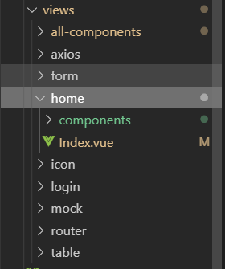

# 手机ERP项目

## 前言

> 本项目是一个基于`vue-cli`的`demo`项目，主要探索开发手机端`ERP`相关技术。

## 目录结构

```
.vscode
dist
documents
plop-templates
public
src
  |--apis
  |--assets
  |--components
  |--icons
  |--router
  |--store
  |--styles
  |--types
  |--views
  |--App.vue
  |--main.ts
  |--shims-tsx.d.ts
  |--shims-vue.d.ts
.gitignore
babel.config.js
package-lock.json
package.json
plopfile.js
README.md
tsconfig.json
vue.config.js
```

## ESLint

为了规范以及美化代码格式，方便团队协作，使用`ESLint`来约束代码，每次代码保存时都会自动进行代码检查以及格式化。具体配置如下：

+ [`Pretter`配置参数](https://prettier.io/docs/en/options.html)
+ `vscode`安装插件`ESLint`
+ 初始化`vue-cli`项目时选择`ESLint + Prettier`
+ `package.json`设置使用单引号、使用行尾分号
```json
"prettier": {
  "singleQuote": true,
  "semi": true,
  "printWidth": 140
},
```
+ `.vscode/setting.json`设置保存自动格式化、对`vue/js/ts`支持
```json
{
  "eslint.autoFixOnSave": true,
  "eslint.validate": [
    "javascript",
    "javascriptreact",
    {
      "language": "vue",
      "autoFix": true
    },
    {
      "language": "typescript",
      "autoFix": true
    }
  ],
}
```

### TODO

+ 配置详情探索

## 页面组织形式

项目中页面存放在`/src/views`目录下，约定每个页面以页面名称新建目录，该目录下新建`Index.vue`为页面内容。  


## CSS

项目采用`sass`方案，`css`命名遵循`BEM`规范。项目全局样式存放在`/src/styles`目录下，分模块为单独文件并在`/src/styles/index.scss`中集中引入，如图：

### 配置样式在项目中全局可以引用

```js
// 修改 vue.config.js
module.exports = {
  css: {
    loaderOptions: { sass: { data: `@import "@/styles/index.scss";` } }
  }
}
```

### 样式变量 -- var.scss

该文件用于存放项目使用的全局样式变量，包括颜色、字体。

### 样式重置 -- reset.scss

该文件用于重置默认的网页样式。

### 主体样式 -- layout.scss

该文件用于存放页面主体样式。

### 样式混合 -- mixin.scss

该文件用于存放混合样式。

## 组件

+ 项目使用`vant`作为主要`UI`框架，引入方式为按需引入，见[配置说明](./vue-component.md#vue-cli3按需引入)。

+ 项目的公共组件存放在`/src/components`目录下，约定每个组件以组件名称新建目录，该目录下新建`Index.vue`为组件内容。为表示该组件为项目公共组件，组件命名时加上前缀`gc-`。考虑到全局组件数量较少且使用频度较高，在`/src/components`目录下新建文件`index.ts`，将所有的全局组件都绑定到`vue`实例上。
```ts
import Vue, { VueConstructor } from 'vue';

function registerAllComponents(
  requireContext: __WebpackModuleApi.RequireContext,
  Vue: VueConstructor
) {
  return requireContext.keys().forEach((x: any) => {
    const comp = requireContext(x);
    Vue.component(comp.default.name, comp.default);
  });
}

registerAllComponents(require.context('./', true, /\/Index.vue$/), Vue);
```

+ 每个页面的组件约定放在该页面所在目录下`./components`目录内，为表示该组件为页面私有组件，建议命名时加上前缀`p-`。

### TODO

+ `toast`挂载到`vue`实例上
+ `toast`统一管理

## 页面/组件模板

为了方便开发时快速生成页面或全局组件模板，引入了`plop`插件。使用方法如下：

+ 运行脚本
```shell
npm run new
```

+ 选择`view or component`

## 项目依赖更新

为了方便检查以及更新项目依赖，引入`check`插件，使用方法：输入脚本后，选择需要更新的依赖，回车即可

```shell
npm run nc
```

## Axios

本项目使用`axios`来进行接口请求，[文档](https://www.kancloud.cn/yunye/axios/234845)

### 使用基本思路

+ 目录`/src`下新建目录`apis`，该目录下新建文件`index.ts`用于对`axios`进行全局配置
+ 为了对接口进行统一的配置管理，每一个用到接口的页面都在`/src/apis`目录下新建对应的`ts`文件，配置该页面用到的接口，如图所示：

### `axios`全局配置

+ loading

+ progress

### `axios`异常处理

+ 单个请求全局
+ 单个请求业务
+ 链式请求全局
+ 链式请求业务

请求接口异常可以分为非200状态码的请求异常以及200状态码的业务异常。对于业务异常项目不做任何处理，由业务方法内自行处理，对于请求异常则是提供默认的错误处理同时将异常抛出。

### TODO

+ 用TS重写axios模块

## 请求缓存

mem

## 数据模拟

由于本地已经部署[Yapi](./yapi.md)，数据模拟直接访问模拟接口即可，使用方法[详见](https://hellosean1025.github.io/yapi/documents/index.html)

## 路由管理

vue-page-stack

## 表单校验

表单校验希望做到校验规则通用性+自定义，校验代码无侵入性。async-validator

## 手势

hammer.js

## `Android/IOS`结合

JSBridge html5plus

## Debug

参见--[vue调试](./vue-debug.md)

## 快速原型开发

+ 拖动式布局
+ 声明式表单

## 异常监控错误日志

### TODO

+ 确认记录方式
+ 全局异常记录
+ 接口异常记录
+ 外部资源加载问题记录

## 常见问题

## 常见业务实践

## end