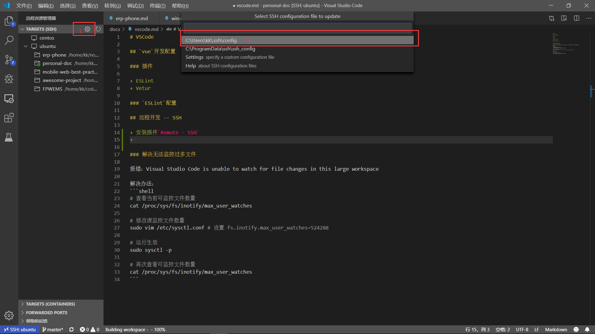

# VSCode

## `vue`开发配置

### 插件

+ ESLint
+ Vetur

### `ESLint`配置

## 远程开发 -- SSH

+ 安装插件`Remote - SSH`
+ 如图进入配置`ssh`
+ 配置参考如下，`IdentityFile`为私钥
```
Host ubuntu
    HostName ubuntu.local
    User kk
    IdentityFile C:\Users\kk\.ssh\id_rsa
```
+ `win10`密钥方式连接`ubuntu`[参考](./windows.md#密钥ssh连接ubuntu)

### 解决无法监控过多文件

报错：Visual Studio Code is unable to watch for file changes in this large workspace

解决办法：
```shell
# 查看当前可监控文件数量
cat /proc/sys/fs/inotify/max_user_watches

# 修改课监控文件数量
sudo vim /etc/sysctl.conf # 设置 fs.inotify.max_user_watches=524288

# 运行生效
sudo sysctl -p

# 再次查看可监控文件数量
cat /proc/sys/fs/inotify/max_user_watches
```